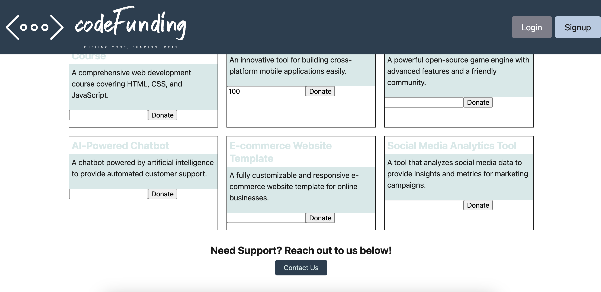

# codeFunding

Deployed link:

## Description

codeFunding is a project that is designed for users to crowd fund for their coding projects. Users can create a project, select a project to donate to, and donate a chosen amount to help the project creators reach their goal!
 

## Table of Contents

1. [Description](#Description) 
2. [Installation](#Installation) 
3. [Usage](#usage) 
4. [License](#license) 
5. [Tests](#tests) 
6. [Collaborators](#collaborators)
7. [Credits](#credits)

## Installation

To install and run codeFunding, follow these steps:
1. Clone the repository.
2. Navigate to the project's root directory.
3. Run the command `npm install` to install the necessary dependencies.
4. Run the command `npm start` to start the application.

## Usage

- Register or log in to an existing account.
- Create a project by providing a title, description, and donation goal.
- View existing projects and choose one to donate to.
- Enter the desired donation amount and complete the payment process.
- Track project progress and see updates from project creators.

## License

This project is licensed under the [MIT License](LICENSE).

## Tests

To run the tests for codeFunding, use the following command: `npm test`.

## Collaborators

- [Amy DiPiazza](https://github.com/amykateoc)
- [Nastacia Shershova](https://github.com/snastacia)
- [Sydnie Farrell](https://github.com/syd9f)

## Credits

Code was debugged with the assistance of Class Instructor, Diego Struk Jaia, and TA, Enriquie Gomez. 

Pulled example and references for code from the following activities: 
- Week 21-MERN (28-Stu_Mini-Project)
- Week 21-MERN (26-Stu-Resolver-Context)
- Week 22-State (28-Stu_Mini-Project)
- Week 22-State (24-Stu_Stripe)